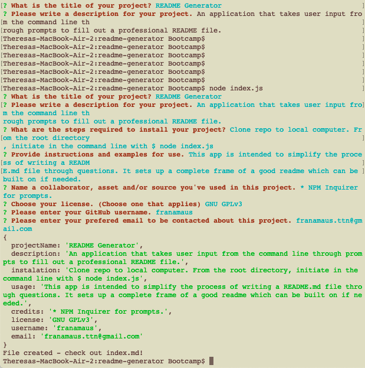
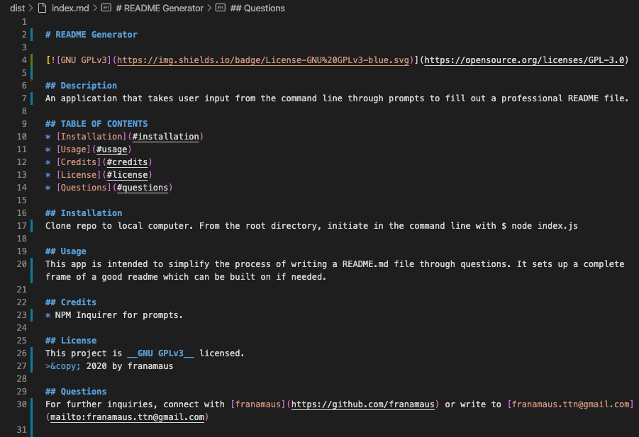
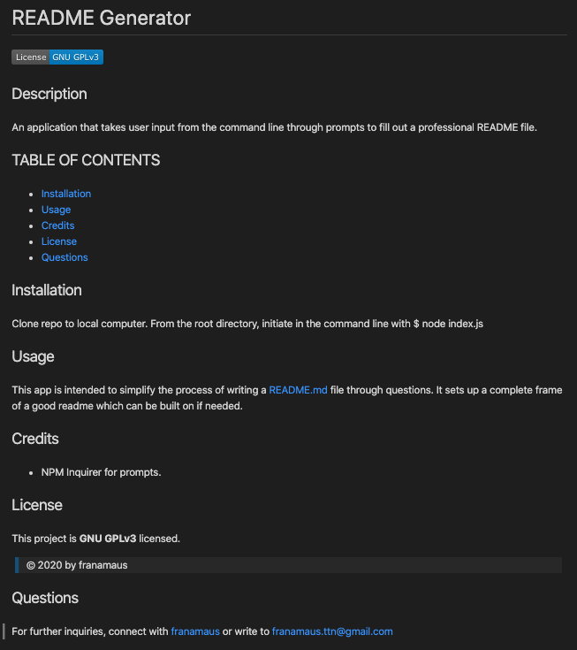

# README Generator

## DESCRIPTION
An application that takes user input from the command line through prompts to fill out a professional README file.

## TABLE OF CONTENTS
* [Installation](#installation)
* [Usage](#usage)
* [Credits](#credits)
* [License](#license)
* [Questions](#questions)

## INSTALLATION
Clone repo to local computer. From the root directory, initiate in the command line with $ node index.js

## USAGE
This app is intended to simplify the process of writing a README.md file through questions. It sets up a complete frame of a good readme which can be built on if needed. See 3 screenshots below.

### __Command line interaction__

### __Rendered markdown file__

### __Preview__

## CREDITS
* NPM Inquirer for prompts.
* Shields.io for badges.
* Starter code by © 2020 Trilogy Education Services, a 2U, Inc. brand.

## LICENSE
This project is __MIT__ licensed.
>&copy; 2020 by Theresa Nguyen.

## QUSTIONS
For further inquiries, connect with [franamaus](https://github.com/franamaus) or write to franamaus.ttn@gmail.com.
